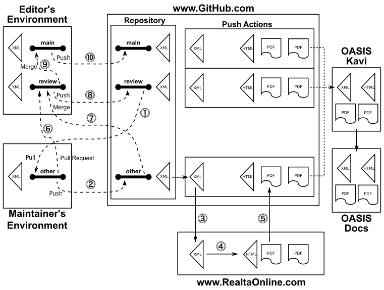

Members of the [OASIS Code List Representation TC](https://www.oasis-open.org/committees/codelist/) create and manage technical content in this TC GitHub repository (https://github.com/oasis-tcs/codelist-genericode/) as part of the TC's chartered work (the program of work and deliverables described in its [charter](https://www.oasis-open.org/committees/codelist/charter.php).

OASIS TC GitHub repositories, as described in [GitHub Repositories for OASIS TC Members' Chartered Work](https://www.oasis-open.org/resources/tcadmin/github-repositories-for-oasis-tc-members-chartered-work), are governed by the OASIS [TC Process](https://www.oasis-open.org/policies-guidelines/tc-process), [IPR Policy](https://www.oasis-open.org/policies-guidelines/ipr), and other policies. While they make use of public GitHub repositories, these repositories are distinct from [OASIS Open Repositories](https://www.oasis-open.org/resources/open-repositories), which are used for development of open source [licensed](https://www.oasis-open.org/resources/open-repositories/licenses) content.

## Description

The OASIS genericode specification incorporates documentation and a number of supporting machine-readable artefacts for the representation and IT-enablement of coded domains populated by "a set of codes representing X". Per the [ISO/IEC 14662 Open-edi Reference Model](https://standards.iso.org/ittf/PubliclyAvailableStandards/) this will satisfy an implementation of the Functional Services View of code lists where the Business Operational View is documented in [ISO/IEC 15944-10 IT-enabled coded domains as semantic components in business transactions](https://standards.iso.org/ittf/PubliclyAvailableStandards/).

The documentation is authored in XML and published in two layouts: the OASIS specification layout and the ISO/IEC Directives Part 2 layout (the latter for potential PAS submission to JTC 1 for international standardization).

Various artefacts, existing and identified to be developed, will be incorporated into the repository for inclusion in the final deliverable.

## Branches, roles, and protocol for contributions

Two branches are restricted (by policy, not by software so please be careful):

- `main` - this is content that has been reviewed by committee members and considered acceptable to be distributed for its intended purpose (which may be for testing or for production use, not necessarily for final use)
- `review` - this is content from the editor that has not been reviewed by committee members yet, and so is not considered agreed-upon for its intended purpose, but the editor has incorporated input from other sources into a package for review; when there is consensus about the content of the `review` branch, it is snapshot in the `main` branch

A "main" copy is not necessarily the final copy, but simply a copy of a "review" copy whose review has been completed.

Two roles are identified.

_Editors_ are responsible for incorporating into review copies (for committee consideration) and main copies (already accepted by the committee) the suggestions made by the maintainers. 

_Maintainers_ create and maintain their own branches and are asked not to check in any changes to the `main` and `review` branches reserved for editors.

Contributions are requested to be submitted by pull requests against the `review` branch to be incorporated by the editor. Maintainers can create and delete any number of their own branches as they see fit. Maintainers are reminded to pull the review changes frequently so as not to diverge far from the work currently under review.

Maintainers can use any XML editing tool to make their changes to the specification document. See "[Preview results](#Preview-results)" below regarding how they can preview their XML edits locally.

Other files and directories can change however needed by the maintainer.

The act of checking a committed branch to GitHub automatically triggers the publishing of the authored XML into OASIS layout PDF, OASIS layout HTML, and ISO Directives Part 2 layout PDF. See "[Published results](#Published-results)" below.

## Detailed steps

1. The maintainer always pulls from the “review” branch into their own private “other” branch of their own naming, not overlapping with the name used by any other maintainer or editor.
Pulling from the “review” branch must be done after every time the editor updates the “review” branch.
A common mistake is to pull from the “main” branch because this is the branch that is visible when one opens the repository.
1. The maintainer makes the changes they wish to their local copy of the “other” branch. A local preview facility allows the maintainer to their edits to the specification fully formatted as an OASIS specification in a web browser.
When completed they commit their changes and push their changes to GitHub.
1. Every push to GitHub triggers a GitHub Action that forwards a copy of the XML to the https://www.RealtaOnline.com server API entry point specific to the desired outputs.
1. The Réalta server prepares the HTML and PDF outputs for the OASIS layout and the PDF output for the ISO Directives Part 2 layout.
1. The Réalta server returns to GitHub the published results in a ZIP file. The Action’s script unzips the results and packages them in a doubly-zipped ZIP file.
The outer ZIP is used to wrap the Action’s artifacts results. The inner ZIP wraps the work product results suitable for posting to the OASIS Kavi server for archive purposes. Inside the inner ZIP contains an archive-only directory recording the control files governing the publishing process, the set of work product files to be posted to the OASIS Docs server, and a ZIP of the work product files for the public to download from the OASIS Docs server. These Action results are transient and not placed into the repository. Eventually GitHub deletes old Action results. 
The maintainer downloads the GitHub Action’s artifacts ZIP file for their review and, if desired, local backup. If they wish to make changes, they return to step 2 and repeat the process.
1. When the maintainer is satisfied with their work to be reviewed by the editor and other team members, they send a pull request to the editor describing their changes that they have committed to their “other” branch.
1. The editor reviews the pull request and, if satisfied with the contribution, they pull the server’s copy of the “other” branch into their local environment and merge it into the “review” branch.
The editor can continue to make any changes they wish in their local copy of the “review” branch.
1. When the editor has incorporated changes from all of the contributing maintainers and is prepared to make the review document available, they push their “review” branch to GitHub.
This push automatically triggers the GitHub Action running the complete publishing process that returns the work product ready for the editor to download from GitHub to review. The GitHub Action results page is disseminated to the committee to download the published results and review.
If maintainers wish to make changes they return to step 1 (not step 2) and repeat the process.
1. When the editor has accommodated all of the feedback from committee members regarding the review and wishes to archive a snapshot for posterity, they merge their local “review” branch into their local “main” branch.
1. The editor pushes their local “main” branch to GitHub.
This push automatically triggers the GitHub Action running the complete publishing process that returns the work product ready for the editor to download from GitHub. The artifacts ZIP is unpacked revealing the inner ZIP that is uploaded to the OASIS Kavi server for posterity and to fulfill the obligation to the public that intermediate work products be easily available.
Following the OASIS TC Process the committee can qualify a snapshot on the OASIS Kavi server to be uploaded by OASIS TC Administration to the OASIS Docs server. When doing so the embedded archive-only directory is not included on the OASIS Docs server, but remains available on the OASIS Kavi server.

## Repository contents

Directories:
- `.github/workflows` - the automated publishing and packaging process triggers performed for every check-in
- `cs01` - the results of publication of the Committee Specification 01 dated 28 December 2007
- `doc` - documentation inputs
  - `doc/genericode.xml` - the specification file being edited
  - `doc/art/*.png` - PDF artwork (maximum width 5.5"/140mm, minimum resolution 300dpi/11.8dpmm)
  - `doc/htmlart/*.png` - HTML artwork (maximum width 750px, resolution irrelevant but one could use 72dpi or 96dpi)
  - `doc/db` - OASIS DocBook library required for HTML presentation and XML presentation 
- `oXygen-frameworks` - document-authoring support for the oXygen XML tool ([see the directory README file](oXygen-frameworks#readme))
- `sch` - Schematron value constraints
- `utilities/ant` - publishing process support
- `xsd` - W3C XML Schema structural constraints

Support files:
- `produceGenericode.*` - publishing and packaging process files converting XML to end-user PDF and HTML documents
- `realta*` - publishing support files

## Preview results

Intermediate edits saved to the `doc/genercode.xml` file can be previewed instantly in a browser on your local computer. It is recommended that one do this to establish their edits are satisfactory before checking in to GitHub to trigger the published results.

Note that the preview HTML presents the PDF images and so the images are dramatically oversized. This is not the case for the published HTML returned from GitHub.

Once the XML has been opened in the browser, it is necessary only to refresh the browser window after each save of the XML edits. It is not necessary to go through the drag-and-drop or open requests.

Opening the XML in Windows:
- drag and drop the XML source onto Internet Explorer, or "right-click, Open with..., Internet Explorer"
- use Ctrl-R or F5 to refresh the browser after editing the file
- this does not work with Firefox, Chrome, or Edge browsers

Opening the XML in Mac OSX:
- drag and drop the XML source onto Safari, or "right-click, Open With, Safari"
- use Cmd-R to refresh the browser after editing the file
- this does not work with Firefox or Chrome browsers

## Published results

The published results are not stored in the GitHub repository, _per se_.

See the [Actions tab](https://github.com/oasis-tcs/codelist-genericode/actions) for the results of publishing processes and distribution packaging, being careful to note the branch indicated for the desired commit message. As branches are merged the commit message is inherited in the merged branch.

You must be signed in to GitHub in order to download the results from the "Artifacts" section on the action's build result page.

Each downloaded result is doubly-zipped: the outer zip for GitHub extraction purposes and the inner zip for posting to Kavi and distribution. Moreover, the actual content is copied in the distribution in its own third ZIP file for posting. The `archive-only-not-in-final-distribution/` subdirectory is not meant for inclusion in the final home in the [OASIS document server](https://docs.oasis-open.org/codelist), only for archive purposes in Kavi.

At particular milestones (typically when the `main` branch is updated) these files are archived in the [committee Kavi documentation (members only)](https://www.oasis-open.org/apps/org/workgroup/codelist/documents.php) [(Public access)](https://www.oasis-open.org/committees/documents.php?wg_abbrev=codelist&show_descriptions=yes).

For genericode v1.0 cs02, the chain of package ZIP files begins [here for OASIS members](https://www.oasis-open.org/apps/org/workgroup/codelist/document.php?document_id=68158) and [here for the general public](https://www.oasis-open.org/committees/document.php?document_id=68158), but be careful to note these links are to the _start_ of the chain. See the top of the document revision history below the metadata for the most current package in the chain of uploaded revisions.

The results in the Actions tab eventually are deleted automatically by GitHub, but if you have no need for a particular build result, you can delete it to save space.

## Contributions

As stated in this repository's [CONTRIBUTING](https://github.com/oasis-tcs/codelist-genericode/blob/master/CONTRIBUTING.md) file, contributors to this repository must be Members of the OASIS Code List Representation TC for any substantive contributions or change requests.  Anyone wishing to contribute to this GitHub project and [participate](https://www.oasis-open.org/join/participation-instructions) in the TC's technical activity is invited to join as an OASIS TC Member. Public feedback is also accepted, subject to the terms of the [OASIS Feedback License](https://www.oasis-open.org/policies-guidelines/ipr#appendixa). 

## Licensing

Please see the [LICENSE](https://github.com/oasis-tcs/codelist-genericode/blob/master/LICENSE.md) file for description of the license terms and OASIS policies applicable to the TC's work in this GitHub project. Content in this repository is intended to be part of the Code List Representation TC's permanent record of activity, visible and freely available for all to use, subject to applicable OASIS policies, as presented in the repository [LICENSE](https://github.com/oasis-tcs/codelist-genericode/blob/master/LICENSE.md). 

## Contact

Please send questions or comments about [OASIS TC GitHub repositories](https://www.oasis-open.org/resources/tcadmin/github-repositories-for-oasis-tc-members-chartered-work) to the [OASIS TC Administrator](mailto:tc-admin@oasis-open.org).  For questions about content in this repository, please contact the TC Chair or Co-Chairs as listed on the Code List Representation TC's [home page](https://www.oasis-open.org/committees/codelist/).
